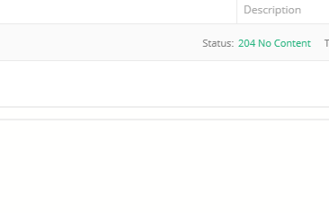

# Dream Park Akka un projet développé en Akka Http ---  PMR PLS 2019/2020 

L’API est documentée au format OpenApis 3 [./openapi.yaml](http://github.com)

## Definition du Projet :
Le projet est un système de gestion d'un espace de parking. Les utilisateurs du système peuvent Consulter à tout moment l'état d'espace (les places libres), ensuite ils peuvent réserver une place pour une date et un plan de tarification donnés. Ensuite l'utilisateur peut annuler la réservation avant la date de début et après il peux régler la réservation et par la suite libérer la place pour d'autres utilisateurs.   

## Modélisation En système d'acteurs :
Dream Park est composé de 3 Acteurs principale (sans compter l'acteur API) qui sont
 - Le PlaceAllocator : il permet la gestion des places (réserver, libérer, get...) 
 - Le ReservationScheduler: il permet la gestion des réservations (créer, annuler, régler) 
 - Le FeeCalculator: le gestionnaire de tarification et le calcule des frais   

Les acteurs se trouvent dans le package: **src/scala/fr/mipn/parc/actors**

Un diagramme en séquences qui illustre les changements entre les différents acteurs se trouve dans le fichier: **src/main/scala/fr/mipn/parc/ParkSystem.scala** https://github.com/Mahfoud047/dream-park-akka/blob/master/src/main/scala/fr/mipn/parc/ParkSystem.scala

Le chemin de base (base-uri) c'est: **http://localhost:8888/api ** 

## Endpoints Disponibles : 
### GET /place 
Récupérer toutes les places d'espace 

réponse:

### GET /place/free 
Récupérer que les places libres d'espace 

réponse:

### GET /pricing
Récupérer tous les plans de tarifications disponibles

réponse:

### GET /reservation
Récupérer toutes les réservations des places

réponse:

### GET /reservation/ {id_reservation}
Récupérer toutes les réservations des places

réponse:

### POST /reservation
Réserver une place libre (ajouter une réservation)

réponse:

### DELETE /reservation /{id_reservation}
Annuler une réservation, cette requête permet de supprimer carrément la réservation et de libérer la place à condition que la date début (startTime) n'a pas encore arrivée, dans ce cas elle retourne avec un code 422 

réponse:

### PUT /reservation/{id_reservation}/settle
Régler la réservation par id (200 ) 

réponse:

L'api est consomé par un client Angular, le projet suivant: https://gitlab.mipn.fr/Mahfoud047/dream-park-client

Réserver:

Consulter la liste des réservations:

